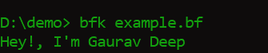

# Brainf\*\*\* Interpreter made in C:

This is a tiny (unnecessarily complicated) interpreter for brainfk.

---

## What Even Is This?

### Brainf\*\*\_ is a programming language with only eight commands (`+`, `-`, `<`, `>`, `[`, `]`, `,`, `.`).

For more information about brainfk here's the link - [Wikipedia](https://en.wikipedia.org/wiki/Brainfuck)

## How to Use It

1. Write your Brainf\*\*\* code.
2. Save it in a file, say `example.bf`.
3. Compile this project. Here’s how:
   ```bash
   gcc -o bfk brainfk.c
   ```
4. Run this interpretor:
   ```bash
   bfk example.bf
   ```
   

## How It Works

1. **Reads Your Code**  
   It reads the file one character at a time, ensuring every symbol makes sense.

2. **Executes Commands**  
   Each token does its thing:
   - `+` and `-`: Changes the value at the pointer.
   - `<` and `>`: Moves the pointer.
   - `,`: Accepts input (but ignores unnecessary whitespace).
   - `.`: Outputs the value at the pointer.
   - `[ ]`: Handles loops with a stack, so it doesn’t lose track.

---

## Example

Here’s a simple “Hello World!” program in Brainf\*\*\*:

```bf
-[------->+<]>-.
-[->+++++<]>++.
+++++++..+++.
[--->+<]>-----.
---[->+++<]>.
-[--->+<]>---.
+++.------.
--------.
-[--->+<]>.
```

Run it using the commands above and all done!.

---
